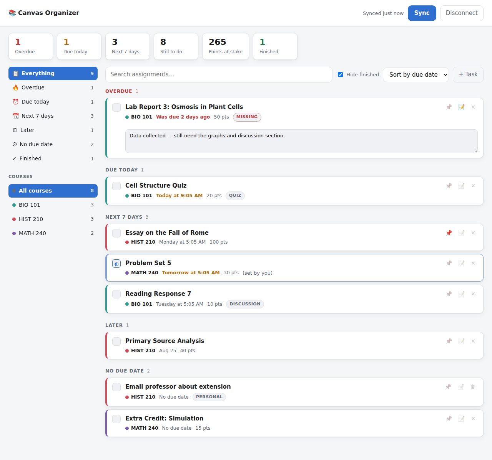

# 📚 Canvas Organizer

Pulls every course and assignment out of Canvas and turns them into one sorted
to-do list: what's overdue, what's due today, what's coming this week, and what
you've already finished.

It runs entirely on your own machine. Your Canvas token and your notes never
leave the computer you run it on.



<sub>Screenshot uses sample data.</sub>

## What it does

- **One list across every course.** Assignments, quizzes and graded discussions
  from all your active courses in a single view.
- **Sorted the way school actually works** — Overdue, Due today, Next 7 days,
  Later, No due date, Finished.
- **Knows what you've turned in.** Anything Canvas shows as submitted or graded
  starts out marked done, so the list only shows real work.
- **Your own progress on top of that.** Mark things *in progress*, tick them off
  early, pin the ones that matter, or ignore an assignment you're skipping.
- **Notes per assignment** — what's left, where the file is, what to ask about.
- **Personal tasks** for the schoolwork Canvas doesn't know about ("read
  chapter 4", "email professor").
- **Filter and search** by course or keyword; sort by due date, course, or points.
- **Points at stake** so you can see where the grade actually is.

Notes, statuses and personal tasks are yours — they're kept locally and survive
every re-sync.

## Setup

You need [Node.js](https://nodejs.org) 18 or newer. There are no dependencies to
install.

```bash
cd canvas-organizer
npm start
```

Then open <http://127.0.0.1:4173> and fill in two things:

1. **Your Canvas address** — whatever you see in the address bar when you're in
   Canvas, e.g. `myschool.instructure.com`.
2. **An access token**, which you generate in Canvas:
   - Go to **Account → Settings**
   - Scroll to **Approved Integrations** → **+ New Access Token**
   - Purpose: "Canvas Organizer"; leave the expiry date blank
   - **Generate Token**, then copy it — Canvas only shows it once

Click **Connect** and it pulls everything in. Press **Sync** whenever you want
fresh data; the app keeps working off the last sync in between.

Run on a different port with `PORT=8080 npm start`. To keep more than one
profile (say, two Canvas accounts), point each at its own folder with
`CANVAS_ORGANIZER_DATA_DIR=~/canvas-work npm start`.

## Where your data lives

Everything is written to `canvas-organizer/data/`, which is git-ignored:

| File | Contents |
| --- | --- |
| `config.json` | Your Canvas URL and access token (file mode `600`) |
| `cache.json` | The last synced snapshot of courses and assignments |
| `state.json` | Your statuses, notes, pins and personal tasks |

Notes:

- The token is stored in plain text, the same way most CLI tools store
  credentials. Anyone with access to your user account on this machine can read
  it, so don't run this on a shared computer.
- The server listens on `127.0.0.1` only, so it isn't reachable from the
  network.
- **Disconnect** deletes `config.json` and the cache but keeps your notes and
  tasks.
- Every Canvas call is read-only. This app never submits, edits or deletes
  anything in Canvas.
- If a token leaks or you're done with it, delete it under **Approved
  Integrations** in Canvas.

## How it's put together

```
server.js         HTTP server: serves the UI, proxies Canvas, merges local state
lib/canvas.js     Canvas REST client — pagination, retries, normalizing records
lib/store.js      Atomic JSON persistence for config, cache and your edits
public/           The dashboard (plain HTML/CSS/JS, no build step)
```

The browser never sees your Canvas token: the page talks only to this app, and
this app talks to Canvas.

## Troubleshooting

**"Canvas rejected the access token (401)"** — the token was deleted or expired.
Generate a new one and reconnect.

**"Could not reach …"** — check the Canvas address. It should be the bare
domain, like `myschool.instructure.com`, not a link to a course page.

**A course is missing** — only courses with an *active, published* enrollment are
pulled, which is what Canvas returns for a current term. Courses that haven't
started yet won't appear.

**An assignment is missing** — unpublished assignments are skipped. If a whole
course fails to load, a warning appears above the list saying which one.
